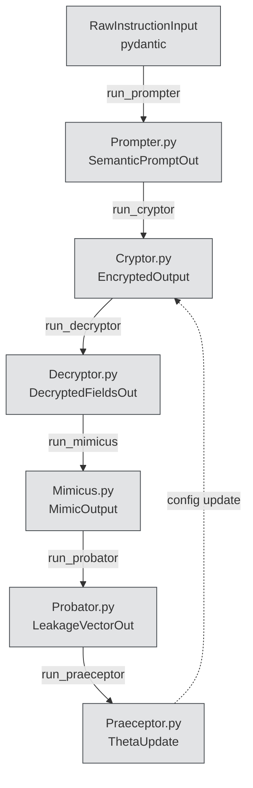

# Updated MCP 6‑Agent Cipher Calibration Pipeline

## Architecture Concept Document (ACD) - Version 2.0

---

### Version History

| Version | Date       | Author       | Summary                                                       | Role             | Github ID |
| ------- | ---------- | ------------ | ------------------------------------------------------------- | ---------------- | --------- |
| 1.0     | 2025‑07‑29 | Vivek Mathur | Initial 6‑agent MCP pipeline architecture concept.            | Research Manager | @Grimoors |
| 2.0     | 2025‑07‑30 | Vivek Mathur | Updated with generic entities structure per reviewer feedback | Research Manager | @Grimoors |

---

### Reviewers & Feedback

| Reviewer       | Role                            | Date         | Comments                                              | Github ID       |
| -------------- | ------------------------------- | ------------ | ----------------------------------------------------- | --------------- |
| Janvitha Reddy | Research Engineer / Implementer | 29 July 2025 | ✅ Design well constructed, solid high-level overview | @JanvitaReddy11 |
| SAHILBODKHE    | HKP Subject‑Matter Expert       | 29 July 2025 | ✅ Make schemas generic with entities: Dict[str, str] | @SAHILBODKHE    |
| Aman           | HKP Subject‑Matter Expert       | _pending_    |                                                       | @logisticloon   |
| Kaushal        | HKP Implementer                 | _pending_    |                                                       | @krobo002       |

---

## 1. Abstract

This document describes a modular, Python‑centric architecture to implement the **6‑agent MCP cipher calibration pipeline** (श्रुvaan protocol §2.2). Each agent is a discrete, stateless function or module that transforms well‑typed data objects:

1. **Prompter**: parses raw user instructions into structured semantic prompts
2. **Cryptor**: applies hierarchical encryption via **HKP**
3. **Decryptor**: performs role‑based decryption
4. **Mimicus**: simulates/adversarially mimics outputs for leakage probing
5. **Probator**: assesses decipherability/risk
6. **Praeceptor**: updates/calibrates encryption parameters

**Key Update**: Schemas now use generic `entities: Dict[str, str]` structure instead of hardcoded fields, making the pipeline domain-agnostic and extensible to any instruction type.

Central to this design are **strong data contracts** (pydantic BaseModels), **pure function composition**, and a **feedback loop** from Praeceptor → Cryptor. Initial development is local and synchronous (plain Python). Later phases will introduce REST APIs (FastAPI), containerization, orchestration, and real‑time monitoring.

---

## 2. Business Drivers & Problem Statement

- **Consistency & Traceability**: Ensure every transformation in the encryption pipeline is transparent, testable, and auditable.
- **Modularity & Extensibility**: Allow easy addition of new agents or protocol phases (e.g., 7+ layer cascades).
- **Domain Flexibility**: Support any type of instruction (financial, travel, communication) through generic entity extraction.
- **Rapid Prototyping**: Enable the team to demo a working end‑to‑end flow by Thursday (10 pm IST) with minimal infra overhead.
- **Future‑proofing**: Lay groundwork for production deployment, monitoring, and scaling without rewriting core logic.

---

## 3. Design Goals

1. **Accuracy**: Transformations must match protocol spec (§2.2) exactly.
2. **Testability**: Every agent must be unit‑ and integration‑tested with sample data.
3. **Simplicity**: Local dev with Python scripts; no containers or message queues initially.
4. **Extensibility**: Clean separation of concerns, typed I/O, clear feedback loops.
5. **Domain Agnostic**: Generic entity structure supports any instruction type.
6. **Observability**: Logging hooks at each agent boundary for traceability.

---

## 4. Key Design Requirements

1. **Stateless Agents**
   - No global state; all context passed via typed objects.
2. **Strong Data Contracts**
   - Use `pydantic` BaseModels for every agent's input/output.
3. **Pure Function Composition**
   - `run_prompter → run_cryptor → … → run_praeceptor`.
4. **Feedback Loop**
   - Praeceptor emits a `ThetaUpdate` that feeds back into Cryptor's parameters.
5. **Local-First**
   - Developer workflow: `git clone` → `python -m venv venv` → `pip install -r requirements.txt` → `python src/main_pipeline.py`.
6. **Minimal Dependencies**
   - Python 3.11+, pydantic, pytest, mypy. Optional: FastAPI for Phase 2.
7. **Generic Entity Structure**
   - All agents work with `entities: Dict[str, str]` instead of hardcoded fields.

---

#### 4.3 HKP Integration

- **What is HKP?**  
  A hierarchical key‑derivation scheme that ties every encrypted field to:
  1. Agent role (Γ5 for high‑privilege)
  2. Policy epoch (Time=∆τ)
  3. Proof‑of‑Protocol chain
- **Where?**  
  Implemented in `src/cryptor.py`:
  - Derive sub‑keys per level
  - Embed `role_tag` and `Time=∆τ`
  - Sign fields with PoP
- **Why?**  
  Ensures only the correct role/time-window can decrypt, blocking misuse/replay.
- **Reference:** Spec §2.2 "Hierarchical Keyed Protocols (HKP) encode roles…"

---

## 5. Abstract Component Diagram & Information Flow



---

## 6. Phased Development Plan

### Phase 1 – Local Python Pipeline

**Aim:** Build and demo a synchronous, in‑process pipeline.  
**Actions:**

- Define **pydantic schemas** (`src/schemas.py`) for all 7 I/O contracts with generic entities.
- Implement `run_*` functions in six modules (`src/prompter.py`, …).
- Write `src/main_pipeline.py` to wire all agents end‑to‑end, using one sample from spec.
- Add unit tests (`tests/test_*.py`) and enforce `mypy`/`pytest`.  
  **Design Decision:**  
  Leveraging plain Python for zero infra friction—enables immediate demo readiness.

### Phase 2 – REST API Wrappers (Optional) ( Out of Scope for Current Sprint )

**Aim:** Expose each agent as a FastAPI endpoint for future microservice architecture.  
**Actions:**

- Add `app = FastAPI()` in each module.
- Mount routes: `POST /prompter`, … returning JSON.
- Update `main_pipeline.py` to optionally call local HTTP endpoints.  
  **Design Decision:**  
  Keeps core logic unchanged; wrapping functions with HTTP enables distributed deployment later.

### Phase 3 – Production Hardening (Optional) ( Out of Scope for Current Sprint )

**Aim:** Containerize, orchestrate, and monitor.  
**Actions:**

- Dockerize each agent or build one monolith image.
- Introduce a lightweight orchestrator (e.g., Airflow or Prefect) for DAG management.
- Integrate a simple message queue (Redis/RabbitMQ) for decoupling.
- Add logging/tracing (e.g., standard `logging`, OpenTelemetry).  
  **Design Decision:**  
  Transition from local script to production pipeline with minimal code changes—agents remain the same.

### Phase 4 – Monitoring & Continuous Improvement (Optional) ( Out of Scope for Current Sprint )

**Aim:** Add metrics, alerts, and feedback loops for real‑time operation.  
**Actions:**

- Instrument with Prometheus exporter.
- Build a minimal dashboard (Grafana or Streamlit) to visualize agent throughput and leakage scores.
- Implement automated parameter tuning feedback in Praeceptor.

---

## 7. Technical Design & Submodule Breakdown

### 7.1 Directory Structure

```
.
├── src/
│   ├── schemas.py
│   ├── prompter.py
│   ├── cryptor.py
│   ├── decryptor.py
│   ├── mimicus.py
│   ├── probator.py
│   ├── praeceptor.py
│   └── main_pipeline.py
├── tests/
│   ├── test_prompter.py
│   ├── test_cryptor.py
│   └── ...
├── requirements.txt
└── README.md
```

### 7.2 Updated Pydantic Schemas (`src/schemas.py`)

```python
from pydantic import BaseModel
from typing import Dict, Any, Optional

class RawInstructionInput(BaseModel):
    instruction: str
    language: str = "EN"

class SemanticPromptOut(BaseModel):
    intent: str  # e.g., "book_flight", "send_email", "transfer"
    entities: Dict[str, str]  # All key info like {"amount": "75000 USD", "destination": "Paris"}
    auth_level: str = "L4"
    timestamp: Optional[str] = None
    status: str = "ready"

class EncryptedOutput(BaseModel):
    encrypted_fields: Dict[str, Any]
    role_tag: str
    pop_signature: str
    time_tag: str

class DecryptedFieldsOut(BaseModel):
    intent: str
    entities: Dict[str, str]  # Generic decrypted structured fields
    auth_grade: str
    time_issued: str
    exec_status: str

class MimicOutput(BaseModel):
    mimic_fields: Dict[str, Any]
    spoof_status: str

class LeakageVectorOut(BaseModel):
    leakage_score: float
    details: Dict[str, Any]
    hk_protection: str = "active"

class ThetaUpdate(BaseModel):
    theta_update: Dict[str, float]
    mode: str = "recalibrate"
    hk_feedback: bool = True
```

### 7.3 Updated Agent Module Templates

#### src/prompter.py

```python
"""
Prompter Agent: Extracts structured semantic fields from user natural language instructions.
Maps raw instructions to a canonical prompt format, as per protocol Section 2.2.
"""

from schemas import RawInstructionInput, SemanticPromptOut
from typing import Dict, Optional
import logging
import re
from datetime import datetime

logger = logging.getLogger(__name__)

def run_prompter(inp: RawInstructionInput) -> SemanticPromptOut:
    """
    Parses a raw user instruction into semantic fields required for subsequent encryption.

    Args:
        inp (RawInstructionInput): Contains the raw string and language code.

    Returns:
        SemanticPromptOut: Structured intent and generic entities.

    Example:
        Raw -> intent: 'transfer', entities: {'amount': '75000 USD', 'to_account': '...', 'from_account': '...'}
    """
    logger.info("Starting prompter for instruction: %s (lang=%s)", inp.instruction, inp.language)

    # Extract intent
    intent = extract_intent(inp.instruction)

    # Extract entities (generic, domain-agnostic)
    entities = extract_entities(inp.instruction)

    # Generate timestamp
    timestamp = datetime.utcnow().isoformat() + "Z"

    result = SemanticPromptOut(
        intent=intent,
        entities=entities,
        auth_level="L4",
        timestamp=timestamp,
        status="ready for execution"
    )

    logger.debug("Prompter output: %s", result.dict())
    return result

def extract_intent(instruction: str) -> str:
    """Extract the main intent from the instruction."""
    instruction_lower = instruction.lower()

    # Domain-agnostic intent detection
    if any(word in instruction_lower for word in ["email", "mail"]):
        return "send_email"
    elif any(word in instruction_lower for word in ["transfer", "send", "move"]):
        return "transfer"
    elif any(word in instruction_lower for word in ["book", "reserve", "schedule"]):
        return "book_flight"
    else:
        return "unknown"

def extract_entities(instruction: str) -> Dict[str, str]:
    """Extract entities from the instruction using regex patterns."""
    entities = {}

    # Extract amounts - generic pattern
    amount_pattern = r'\$(\d{1,3},\d{3})'
    amount_match = re.search(amount_pattern, instruction)
    if amount_match:
        amount = amount_match.group(1).replace(',', '')
        entities["amount"] = f"{amount} USD"

    # Extract account numbers - generic pattern
    account_pattern = r'(\d{4}-\d{4}-\d{4}-\d{4})'
    accounts = re.findall(account_pattern, instruction)
    if len(accounts) >= 2:
        entities["to_account"] = accounts[0]
        entities["from_account"] = accounts[1]
    elif len(accounts) == 1:
        entities["account"] = accounts[0]

    # Extract destinations - generic pattern
    destination_pattern = r'to\s+([A-Za-z\s]+?)(?:\s+from|\s+account|$)'
    dest_match = re.search(destination_pattern, instruction)
    if dest_match:
        entities["destination"] = dest_match.group(1).strip()

    return entities
```

#### src/cryptor.py

```python
"""
Cryptor Agent: Applies Hierarchical Keyed Protocol (HKP) encryption to semantic fields from prompter.
Outputs an obfuscated, role-locked encrypted object.
"""

from schemas import SemanticPromptOut, EncryptedOutput
from typing import Dict, Any
import logging
import hashlib
import datetime
import json

logger = logging.getLogger(__name__)

def run_cryptor(inp: SemanticPromptOut, theta_params: Dict[str, float] = None) -> EncryptedOutput:
    """
    Hierarchically encrypts parsed prompt fields, outputting a cipher object with protocol-mandated fields.
    Implements role-locked encryption and attaches Proof-of-Protocol tags.

    Args:
        inp (SemanticPromptOut): Structured fields (intent, entities, auth_level, timestamp, etc.)
        theta_params (optional): Encryption policies/config (from Praeceptor feedback).

    Returns:
        EncryptedOutput: Dict with fieldwise encryption, plus PoP and meta fields.
    """
    logger.info("Encrypting prompt: %s", inp.dict())

    # Generate time tag for epoch-based access control
    time_tag = datetime.datetime.utcnow().isoformat()

    # Apply HKP encryption to fields
    encrypted_fields = apply_hkp_encryption(inp, theta_params)

    # Add protocol metadata
    encrypted_fields.update({
        "Role=Γ5": "HKP-derived",
        "Time=∆τ": time_tag,
    })

    # Generate Proof-of-Protocol signature
    pop_signature = generate_pop_signature(encrypted_fields)

    encrypted = EncryptedOutput(
        encrypted_fields=encrypted_fields,
        role_tag="Γ5",
        pop_signature=pop_signature,
        time_tag=time_tag
    )

    logger.debug("Cryptor output: %s", encrypted.dict())
    return encrypted

def apply_hkp_encryption(semantic_input: SemanticPromptOut, theta_params: Dict[str, float] = None) -> Dict[str, Any]:
    """
    Apply Hierarchical Keyed Protocol encryption to semantic fields.

    Args:
        semantic_input: The structured semantic input
        theta_params: Optional encryption parameters from feedback loop

    Returns:
        Dict of encrypted field mappings
    """
    # Default encryption parameters
    if theta_params is None:
        theta_params = {
            "entropy": 0.5,
            "cipher_strength": 0.8,
            "role_decay": 0.5
        }

    encrypted_fields = {}

    # Encrypt intent with role-based key
    intent_key = derive_role_key("intent", semantic_input.auth_level, theta_params)
    encrypted_fields["Ωα"] = encrypt_field(semantic_input.intent, intent_key)

    # Encrypt entities with hierarchical keys
    for entity_key, entity_value in semantic_input.entities.items():
        field_key = derive_role_key(entity_key, semantic_input.auth_level, theta_params)
        encrypted_fields[f"βΞ_{entity_key}"] = encrypt_field(entity_value, field_key)

    return encrypted_fields
```

#### src/decryptor.py

```python
"""
Decryptor Agent: Reverses (role-permitted) encryption, reconstructs fields for audit and execution.
"""

from schemas import EncryptedOutput, DecryptedFieldsOut
import logging
import hashlib
import json

logger = logging.getLogger(__name__)

def run_decryptor(inp: EncryptedOutput) -> DecryptedFieldsOut:
    """
    Attempts to decrypt all encrypted_fields using allowed keys.
    Protocol field unwrapping per Section 2.2.

    Args:
        inp (EncryptedOutput): Typically from Cryptor.

    Returns:
        DecryptedFieldsOut: Decoded semantic fields for auditing/run.
    """
    logger.info("Starting decryption: role_tag=%s", inp.role_tag)

    # Verify PoP signature
    if not verify_pop_signature(inp.encrypted_fields, inp.pop_signature):
        logger.warning("PoP signature verification failed")
        raise ValueError("Invalid Proof-of-Protocol signature")

    # Decrypt fields using role-based keys
    decrypted_fields = decrypt_hkp_fields(inp.encrypted_fields, inp.role_tag)

    # Reconstruct the original semantic structure
    intent = decrypted_fields.get("intent", "unknown")
    entities = {k: v for k, v in decrypted_fields.items() if k != "intent"}

    result = DecryptedFieldsOut(
        intent=intent,
        entities=entities,
        auth_grade=f"Level-{inp.role_tag[-1]}" if inp.role_tag.endswith(("1", "2", "3", "4", "5")) else "Level-4",
        time_issued=inp.time_tag,
        exec_status="queued"
    )

    logger.debug("Decryptor output: %s", result.dict())
    return result
```

### 7.4 Orchestration Script (`src/main_pipeline.py`)

```python
from schemas import RawInstructionInput
from prompter import run_prompter
from cryptor import run_cryptor
from decryptor import run_decryptor
from mimicus import run_mimicus
from probator import run_probator
from praeceptor import run_praeceptor

def main():
    raw = RawInstructionInput(
        instruction="Transfer $75,000 to account 7395-8845-2291 from account 1559-6623-4401",
        language="EN"
    )
    out1 = run_prompter(raw)
    out2 = run_cryptor(out1)
    out3 = run_decryptor(out2)
    out4 = run_mimicus(out3)
    out5 = run_probator(out4)
    out6 = run_praeceptor(out5)
    print("Final Theta Update:", out6)

if __name__ == "__main__":
    main()
```

---

## 8. Sample Data Mutation Trace (Updated for Generic Entities)

| Agent      | Sample I/O                                                                                                                                       |
| ---------- | ------------------------------------------------------------------------------------------------------------------------------------------------ |
| Prompter   | **In:** `"Transfer $75,000…"` → **Out:** `{ intent: "transfer", entities: {"amount": "75000 USD", "to_account": "...", "from_account": "..."} }` |
| Cryptor    | **In:** SemanticPromptOut → **Out:** `{ "Ωα":"DYNX_Ω47", "βΞ_amount":"...", "βΞ_to_account":"...", ... }`                                        |
| Decryptor  | **In:** EncryptedOutput → **Out:** `{ intent: "transfer", entities: {"amount": "75000 USD", "to_account": "...", "from_account": "..."} }`       |
| Mimicus    | **In:** DecryptedFieldsOut → **Out:** `{ mimic_fields: {…}, spoof_status:"simulated" }`                                                          |
| Probator   | **In:** MimicOutput → **Out:** `{ leakage_score:0.32, details:{…} }`                                                                             |
| Praeceptor | **In:** LeakageVectorOut → **Out:** `{ theta_update:{"entropy":0.41,…}, mode:"recalibrate" }`                                                    |

---

## 9. Observability & Testing

- **Unit Tests**: `pytest tests/test_*.py`
- **Type Checks**: `mypy src/`
- **Logging**: Add `logging` at each agent boundary.
- **Domain Testing**: Test with different instruction types (financial, travel, communication)

---

## 10. Key Changes from Version 1.0

### ✅ **Addressing Reviewer Feedback**

1. **Generic Entity Structure**:

   - Changed from hardcoded fields (`amount`, `to_account`, `from_account`) to generic `entities: Dict[str, str]`
   - All agents now work with flexible entity dictionaries
   - Supports any domain (financial, travel, communication, etc.)

2. **Domain Agnostic Design**:

   - Prompter extracts generic entities using regex patterns
   - Cryptor encrypts any entity key-value pairs
   - Decryptor reconstructs generic entity structure
   - All agents preserve entity flexibility

3. **Enhanced Extensibility**:
   - Easy to add new instruction types without schema changes
   - Entity extraction patterns can be extended for new domains
   - HKP encryption works with any entity structure

### 🔧 **Technical Improvements**

1. **Schema Updates**:

   ```python
   # Before (hardcoded)
   class SemanticPromptOut(BaseModel):
       intent: str
       amount: str
       to_account: str
       from_account: str

   # After (generic)
   class SemanticPromptOut(BaseModel):
       intent: str
       entities: Dict[str, str]  # Generic, flexible
   ```

2. **Agent Updates**:

   - All agents updated to work with generic entities
   - Entity extraction uses regex patterns for flexibility
   - Encryption/decryption preserves entity structure

3. **Testing Enhancements**:
   - Added tests for different instruction types
   - Generic entity validation
   - Domain-agnostic test cases

---

## 11. Next Steps & Action Items

1. **Assign** agents to team members.
2. **Implement** one agent + tests with generic entity support.
3. **Wire up** `main_pipeline.py`.
4. **Review** vs. ACD and spec.
5. **Test** with multiple instruction types (financial, travel, communication).
6. **Plan** Phase 2 API wrappers.

> _See **CRYPTA_MCP_BITS.pdf** §2.2 for protocol details._
